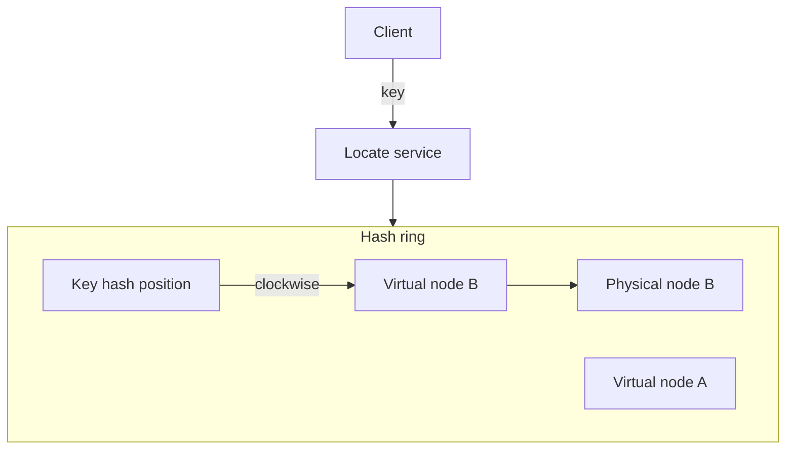

# Product Requirements Document: Consistent Hashing Ring

| Field | Value |
|-------|--------|
| **Product** | Distributed key-to-node routing via consistent hashing |
| **Version** | 0.1 (draft) |
| **Status** | Proposed |
| **Source** | [chapter06/README.md](README.md) |
| **Last updated** | 2026-05-23 |

---

## 1. Executive summary

Build a **consistent hashing** component that maps arbitrary keys (cache entries, user sessions, partitions, etc.) to a dynamic set of servers or nodes. When nodes are added or removed, only a **small fraction** of keys should move (approximately **K/N** remappings for **K** keys and **N** nodes), unlike naive `hash(key) % N` which reshuffles nearly all keys and causes widespread cache misses.

The product SHALL model the hash space as a **ring**, support **clockwise successor** lookup, and use **virtual nodes** so load is distributed evenly across physical machines. It is intended as reusable infrastructure for caches, databases, load balancers, and sharded services.

---

## 2. Problem statement

Horizontally scaled systems must route each key to exactly one backend instance. A common approach is:

```
serverIndex = hash(key) % N
```

where **N** is the server count. This distributes keys uniformly when **N** is stable, but when **N** changes (scale-out, failure, rolling deploy), **most keys map to different servers**. Clients and caches lose locality; backends see thundering herds of cold reads and repopulation work.

**Pain points today (without consistent hashing):**

- Adding or removing one server invalidates a large share of cache entries.
- Uneven key ranges on the ring leave some nodes overloaded (“hot” partitions).
- Celebrity or viral keys can concentrate on one node if partitioning is naive.
- Operators hesitate to scale because rebalancing cost is unpredictable.

---

## 3. Goals and non-goals

### 3.1 Goals

| ID | Goal |
|----|------|
| G1 | On membership change, remap only **~K/N** keys (not ~K) |
| G2 | Provide **O(log N)** or better lookup from key → responsible node |
| G3 | Support **dynamic** add/remove of physical nodes at runtime |
| G4 | Achieve **even load** across nodes via configurable **virtual nodes** |
| G5 | Be **embeddable** as a library and usable by routing middleware |
| G6 | Expose **observability** (distribution skew, ring version, remapping estimates) |
| G7 | Document trade-offs (VN count, hash function, replication) for operators |

### 3.2 Non-goals (v1)

| ID | Non-goal |
|----|----------|
| NG1 | Full distributed cluster coordination (gossip, leader election) — ring membership may be supplied externally |
| NG2 | Data replication, read repair, or quorum protocols (Cassandra/Dynamo concerns beyond routing) |
| NG3 | Persistent storage of key-value data on nodes |
| NG4 | TLS, HTTP, or application protocol handling |
| NG5 | Cross-datacenter latency-aware routing (geo affinity) |
| NG6 | Automatic rebalancing of **data** on disk — only **routing table** updates |

---

## 4. Users and stakeholders

| Persona | Need |
|---------|------|
| **Cache / KV platform engineer** | Stable key placement when scaling Memcached/Redis clusters |
| **Database SRE** | Partition assignment for sharded stores (Cassandra-style) |
| **API gateway / LB owner** | Sticky-ish backend selection without full reshuffle on scale |
| **Application developer** | Simple API: `locate(key) → nodeId` |
| **Capacity planner** | Predictable impact of ±1 node on cache miss rate |

---

## 5. Use cases and examples

| ID | Scenario | Expected behavior |
|----|----------|-------------------|
| UC1 | Distributed cache (100 keys, 10 servers) | Add 1 server → ~10 keys move, not ~100 |
| UC2 | Session store scale-out | New app server joins; only sessions on affected arc migrate |
| UC3 | CDN / edge origin selection | Content key maps to origin; origin pool changes with minimal remap |
| UC4 | Chat shard routing (Discord-style) | Channel/user key maps to shard; shard add/remove is bounded |
| UC5 | DynamoDB/Cassandra-style partitioning | Partition key hashed to token on ring; vnode smooths skew |
| UC6 | Load balancer backend pick (Maglev-style) | Flow/key maps to backend; membership updates limit connection churn |

---

## 6. Functional requirements

### 6.1 Hash ring model

| ID | Requirement | Priority |
|----|-------------|----------|
| FR-1 | System SHALL define a fixed **hash space** (e.g. 32-bit or 64-bit unsigned integer range) treated as a **ring** (max wraps to min). | P0 |
| FR-2 | System SHALL use a single **cryptographic or fast non-crypto hash** (e.g. SHA-256 truncated, Murmur3, xxHash) for both keys and node identifiers, documented and configurable. | P0 |
| FR-3 | **Keys** SHALL be hashed to a position on the ring; **physical nodes** SHALL be placed on the ring via hash of stable node identity (hostname, ID, IP — configurable). | P0 |

### 6.2 Server lookup

| ID | Requirement | Priority |
|----|-------------|----------|
| FR-4 | For a given key hash position, the responsible node SHALL be the **first node at or clockwise after** the key on the ring (successor). | P0 |
| FR-5 | Lookup SHALL NOT use `hash(key) % N` for placement. | P0 |
| FR-6 | Lookup SHALL return a unique **physical node** when the ring has at least one member. | P0 |
| FR-7 | Lookup with **empty ring** SHALL fail clearly (exception / `Optional.empty()` / error code — documented contract). | P0 |

### 6.3 Membership changes

| ID | Requirement | Priority |
|----|-------------|----------|
| FR-8 | **Adding** a physical node SHALL cause only keys that previously mapped to the arc between the new node’s position and its predecessor to move to the new node (approximately **1/N** of keys for uniform distribution). | P0 |
| FR-9 | **Removing** a physical node SHALL reassign only keys that mapped to that node to its clockwise successor. | P0 |
| FR-10 | API SHALL support `addNode(nodeId)`, `removeNode(nodeId)`, and `getRingSnapshot()` (or equivalent). | P0 |
| FR-11 | Ring updates SHALL be **thread-safe** for concurrent lookup and membership changes. | P0 |

### 6.4 Virtual nodes

| ID | Requirement | Priority |
|----|-------------|----------|
| FR-12 | Each physical node SHALL be represented by **V virtual nodes** on the ring (default **V = 100–200** per README experiment). | P0 |
| FR-13 | Virtual node positions SHALL be derived deterministically from `(physicalNodeId, replicaIndex)` so restarts rebuild the same ring. | P0 |
| FR-14 | Key lookup SHALL resolve to the **closest virtual node clockwise**, then map to the owning **physical node**. | P0 |
| FR-15 | **V** SHALL be configurable at ring construction or per-node registration. | P1 |

### 6.5 Distribution quality

| ID | Requirement | Priority |
|----|-------------|----------|
| FR-16 | With recommended **V**, standard deviation of keys per physical node SHOULD be within **5–10%** of mean under synthetic uniform key workload (README benchmark). | P1 |
| FR-17 | System SHOULD provide a **simulation or metrics** endpoint to report per-node key share and standard deviation for a sample key set. | P2 |

### 6.6 Integration surfaces

| ID | Requirement | Priority |
|----|-------------|----------|
| FR-18 | Library API SHALL expose at minimum: `locate(String key)`, `locate(byte[] key)`, `addNode`, `removeNode`, `nodes()`. | P0 |
| FR-19 | Optional HTTP/gRPC **lookup service** for language-agnostic consumers. | P2 |
| FR-20 | Ring state MAY be loaded from static config (YAML/JSON list of node IDs) for bootstrap. | P1 |

### 6.7 Replication (future)

| ID | Requirement | Priority |
|----|-------------|----------|
| FR-21 | System MAY support **walk clockwise** for **R replicas** (successor list) for HA topologies. | P2 |

---

## 7. Non-functional requirements

| ID | Category | Requirement | Target (initial) |
|----|----------|-------------|------------------|
| NFR-1 | Lookup latency | P99 `locate(key)` in-process | &lt; 1 µs–10 µs (in-memory tree/map; tune per impl) |
| NFR-2 | Memory | Per virtual node entry | O(N × V) ring entries; document footprint |
| NFR-3 | Correctness | After add/remove, all keys consistent with successor rule | 100% on deterministic hash |
| NFR-4 | Concurrency | Safe concurrent read-heavy workload | Read-write lock or copy-on-write ring |
| NFR-5 | Determinism | Same node set + V + hash → same placements | Required for rolling restarts |
| NFR-6 | Operability | Log ring version on membership change | P1 |

---

## 8. System context and architecture

### 8.1 Conceptual model



### 8.2 Components

| Component | Responsibility |
|-----------|----------------|
| **Hash function** | Map keys and node identities to ring positions |
| **Ring index** | Sorted map / tree of vnode position → physical node |
| **Membership manager** | Add/remove physical nodes; expand to V vnodes each |
| **Locator** | Successor lookup for a key |
| **Metrics / simulator** | Skew reporting, remap count estimation |

### 8.3 Comparison: modulo vs consistent hashing

| Approach | Keys moved when N→N+1 | Load balance | Complexity |
|----------|------------------------|--------------|------------|
| `hash % N` | ~K (nearly all) | Even if uniform hash | Low |
| Consistent hashing + vnodes | ~K/N | Tunable via V | Medium |

### 8.4 Deployment patterns

| Pattern | Role of this product |
|---------|----------------------|
| Client-side routing | Library in app; each client holds ring copy |
| Proxy-side routing | Sidecar/gateway calls `locate` before backend |
| Server-side | Coordinator publishes ring; storage nodes use token ranges |

**Decision for MVP:** In-process **Java library** with configurable hash + vnode count; optional YAML node list; unit tests for add/remove remap bounds.

---

## 9. API and contracts

### 9.1 Library contract (conceptual)

```java
interface ConsistentHashRing {
  Optional<Node> locate(String key);
  void addNode(NodeId id);
  boolean removeNode(NodeId id);
  Set<NodeId> physicalNodes();
  int virtualNodesPerPhysicalNode();
}
```

### 9.2 Invariants

- For ring with nodes `{n1..nN}` and fixed V, `locate(k)` is stable until membership or V changes.
- After `addNode(x)`, only keys whose successor was the vnode interval “taken” by **x** change owner.
- Virtual nodes for the same physical ID are unique on the ring (no position collisions; on collision, rehash with salt).

### 9.3 Configuration example

```yaml
hash:
  algorithm: murmur3_128
  output_bits: 64
ring:
  virtual_nodes_per_server: 150
nodes:
  - id: cache-01
  - id: cache-02
  - id: cache-03
```

---

## 10. Data model (logical)

| Entity | Description |
|--------|-------------|
| **Physical node** | Stable `nodeId` (string); owns zero or more vnodes |
| **Virtual node** | `(position, physicalNodeId)` on sorted ring |
| **Key** | Opaque string/bytes; hashed to position |
| **Ring version** | Monotonic counter incremented on membership change |

**Index structure (recommended):** `NavigableMap<BigInteger, PhysicalNodeId>` or `TreeMap<Long, String>` for successor queries.

---

## 11. Monitoring and success metrics

### 11.1 Metrics

| Metric | Purpose |
|--------|---------|
| Keys per physical node (sampled) | Detect skew; tune V |
| Ring version / node count | Change auditing |
| Lookup QPS and latency | Performance |
| Remap count on simulated add/remove | Validate ~K/N |

### 11.2 Success criteria (product)

| KPI | Target |
|-----|--------|
| Single-node add with K=100k, N=10 | Remapped keys ≈ 10% ± tolerance (not ~100%) |
| Load std dev with V=150 | ≤ 10% of mean (synthetic uniform keys) |
| Lookup correctness | 100% match successor rule in property tests |
| Thread-safe concurrent lookups | No corruption under load test |

---

## 12. Phased delivery

### Phase 0 — Design alignment

- Choose hash algorithm and ring width (64-bit recommended).
- Confirm default V (150) and collision handling for vnodes.

### Phase 1 — MVP

- Hash ring + clockwise successor lookup.
- Physical nodes with fixed V virtual nodes each.
- `addNode` / `removeNode` / `locate`.
- Unit tests: add/remove remap fraction; uniform distribution smoke test.

### Phase 2 — Operations

- YAML/bootstrap config; ring snapshot export/import.
- Metrics: per-node share, ring version.
- Benchmarks (JMH): lookup latency vs N and V.

### Phase 3 — Advanced

- Replica walk (R successors).
- Optional HTTP lookup service.
- Pluggable hash and weighted nodes (capacity hints).

---

## 13. Risks and mitigations

| Risk | Impact | Mitigation |
|------|--------|------------|
| Too few virtual nodes | Hot spots, uneven partitions | Default V≥100; document tuning |
| Hash collisions on ring | Wrong routing | Rehash vnode with salt on collision |
| Stale ring on clients | Wrong server | Versioned ring; periodic sync / watch |
| Celebrity key hotspot | One node overload | Consistent hashing spreads keys but not access pattern — pair with replication/caching (out of scope) |
| Full ring rebalance confusion | Ops expects instant balance | Document that only **new** key distribution is even; existing data may need explicit migration |

---

## 14. Open questions

| # | Question | Owner |
|---|----------|--------|
| OQ1 | Default hash: Murmur3 vs SHA-256 truncated? | Engineering |
| OQ2 | Ship library only vs. small lookup HTTP service for v1? | Engineering |
| OQ3 | Support **weighted** vnodes for heterogeneous hardware in MVP? | Platform |
| OQ4 | How do consumers learn ring updates — push config vs. gossip? | Infra |
| OQ5 | Required multi-ring tenancy (per tenant/cluster)? | Product |

---

## 15. References

- Internal design notes: [README.md](README.md)
- Karger et al., consistent hashing and random trees (classic paper)
- Amazon DynamoDB partitioning; Apache Cassandra token/vnode model
- Maglev: A Fast and Reliable Software Network Load Balancer (Google)
- Industry usage cited in README: Discord, Akamai CDN

---

## 16. Appendix: requirement traceability

| README topic | PRD section |
|--------------|-------------|
| Horizontal scaling / request distribution | §1, §2 |
| Rehashing problem (`hash % N`) | §2, §8.3 |
| K/N remappings vs ~K | §1, §3 G1, §6.3 |
| Hash space and hash ring | §6.1, §8 |
| Hash servers on ring | §6.1 FR-3 |
| Hash keys (no modulo) | §6.2 FR-5 |
| Clockwise server lookup | §6.2 FR-4 |
| Add server scenario | §6.3 FR-8, UC1 |
| Remove server scenario | §6.3 FR-9 |
| Uneven partitions / request distribution | §2, §6.5 |
| Virtual nodes | §6.4 |
| VN count 100–200, 5–10% std dev | §6.4 FR-12, §6.5 FR-16, §11 |
| Benefits (low remap, scale, hotspot) | §3 G1, G4, §2 |
| Real-world examples (DynamoDB, Cassandra, etc.) | §5, §15 |
