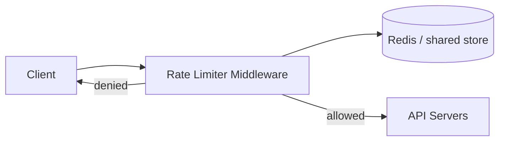

# Product Requirements Document: Distributed Rate Limiter

| Field | Value |
|-------|--------|
| **Product** | Server-side distributed rate limiter |
| **Version** | 0.1 (draft) |
| **Status** | Proposed |
| **Source** | [chapter05-rate_limiter/README.md](README.md) |
| **Last updated** | 2026-05-17 |

---

## 1. Executive summary

Build a **server-side rate limiter** for a distributed system that controls how many requests clients may send to backend services within configurable time windows. When traffic exceeds configured limits, excess requests are **rejected** (with optional queueing) and clients are **informed** so they can back off.

The product must support **flexible throttling rules** (by IP, user ID, API endpoint, or other dimensions), run at **high scale** with **low latency**, and remain **available** when shared cache infrastructure degrades.

---

## 2. Problem statement

Unbounded client traffic can overload services, increase infrastructure cost, enable abuse (e.g. DoS), and inflate charges from downstream dependencies billed per call. APIs need a centralized mechanism to enforce quotas such as “2 posts per second per user” or “10 accounts per day per IP” without requiring every service team to reimplement limiting logic.

**Pain points today (without a rate limiter):**

- Services saturate under traffic spikes.
- Abuse and accidental retry storms are hard to contain.
- Per-call downstream costs grow unchecked.
- Inconsistent limits across teams and endpoints.

---

## 3. Goals and non-goals

### 3.1 Goals

| ID | Goal |
|----|------|
| G1 | Accurately block or defer requests that exceed configured limits |
| G2 | Enforce limits in a **distributed** environment (multiple limiter instances) |
| G3 | Support **configurable rules** (dimension, window, limit, algorithm) |
| G4 | Operate with **low latency** and **minimal memory** per request |
| G5 | **Notify clients** when throttled (HTTP 429 + standard headers) |
| G6 | **Continue functioning** (degraded if needed) when cache is unavailable |
| G7 | Provide **monitoring** to validate rules and algorithm effectiveness |

### 3.2 Non-goals (v1)

| ID | Non-goal |
|----|----------|
| NG1 | Client-side-only rate limiting as the primary enforcement layer |
| NG2 | Full API gateway feature set (SSL termination, static assets, auth) — only rate limiting scope |
| NG3 | Billing, invoicing, or chargeback reporting |
| NG4 | L3/network-layer (packet) rate limiting |
| NG5 | Guaranteed 100% accuracy for approximate algorithms (acceptable trade-off documented per algorithm) |

---

## 4. Users and stakeholders

| Persona | Need |
|---------|------|
| **API consumer (client developer)** | Predictable limits, clear errors, headers for retry timing |
| **Platform / SRE** | Protect fleet capacity, tune rules, observe drops and latency |
| **Product / security** | Prevent abuse (spam, credential stuffing, reward farming) |
| **Service owner** | Per-endpoint quotas without custom code in every service |
| **FinOps** | Cap calls to paid downstream APIs |

---

## 5. Use cases and examples

| ID | Scenario | Rule (example) |
|----|----------|----------------|
| UC1 | Social posting | Max 2 posts per second per user |
| UC2 | Account creation abuse | Max 10 accounts per day per IP |
| UC3 | Promotional rewards | Max 10 claims per week per user |
| UC4 | Public API quota | 300 requests per 3 hours per API key (e.g. Twitter-style) |
| UC5 | Marketing messages | Max 5 messages per day per user (Lyft-style) |
| UC6 | Authentication brute force | Max N login attempts per minute per IP or account |

---

## 6. Functional requirements

### 6.1 Placement and integration

| ID | Requirement | Priority |
|----|-------------|----------|
| FR-1 | Rate limiting SHALL run **server-side** (not rely on client honesty). | P0 |
| FR-2 | System SHALL support deployment as **middleware** (e.g. API gateway) or **embedded library** in services. | P1 |
| FR-3 | Middleware SHALL intercept requests **before** they reach origin API servers when deployed in gateway mode. | P0 |

### 6.2 Rule model

| ID | Requirement | Priority |
|----|-------------|----------|
| FR-4 | Operators SHALL define rules with at least: **identifier dimension** (e.g. `user_id`, `ip`, `api_key`, `endpoint`), **limit**, **time window**, and **algorithm**. | P0 |
| FR-5 | System SHALL support **multiple concurrent rules** (e.g. per-endpoint buckets, per-IP buckets, global bucket). | P0 |
| FR-6 | Rules SHALL be stored in **configuration** (e.g. files on disk) and loaded into an **in-memory cache** by background workers on a schedule. | P0 |
| FR-7 | Rule changes SHALL take effect without requiring full service restart (via periodic reload). | P1 |

**Example rule shape (conceptual):**

```yaml
rules:
  - name: write_posts
    key: user_id
    match: endpoint == POST /posts
    limit: 2
    window: 1s
    algorithm: token_bucket
    bucket_size: 2
    refill_rate: 2
```

### 6.3 Request evaluation

| ID | Requirement | Priority |
|----|-------------|----------|
| FR-8 | For each incoming request, the limiter SHALL resolve applicable rule(s), fetch counter/state from shared store, and decide **allow** or **deny**. | P0 |
| FR-9 | Allowed requests SHALL proceed to downstream API servers unchanged except for optional rate-limit response headers. | P0 |
| FR-10 | Denied requests SHALL return **HTTP 429 Too Many Requests** by default. | P0 |
| FR-11 | Denied requests MAY be **dropped** or **enqueued** for later processing (configurable per rule). | P2 |

### 6.4 Client notification

| ID | Requirement | Priority |
|----|-------------|----------|
| FR-12 | Throttled responses SHALL inform the client (not silent drop). | P0 |
| FR-13 | Responses SHOULD include headers: `X-Ratelimit-Limit`, `X-Ratelimit-Remaining`, `X-Ratelimit-Retry-After` (seconds until retry is safe). | P0 |

### 6.5 Algorithms (pluggable)

The product SHALL support one or more algorithms; default recommendation for v1: **token bucket** (industry standard, burst-friendly).

| Algorithm | Behavior summary | When to use | v1 |
|-----------|------------------|-------------|-----|
| Token bucket | Tokens refill at fixed rate; each request consumes one token; bucket has max capacity | Bursts allowed within capacity; APIs (Amazon, Stripe) | **Default** |
| Leaking bucket | Queue requests; process at fixed outflow rate | Stable outflow to downstream (Shopify) | P2 |
| Fixed window counter | Count per fixed time slice | Simple quotas, explicit window reset | P1 |
| Sliding window log | Store per-request timestamps; prune old | Highest accuracy, higher memory | P2 |
| Sliding window counter | Weighted blend of current + previous window | Balance accuracy and memory (~0.003% error cited) | P1 |

| ID | Requirement | Priority |
|----|-------------|----------|
| FR-14 | Algorithm parameters (e.g. bucket size, refill rate, window size) SHALL be configurable per rule. | P0 |
| FR-15 | System SHALL document accuracy vs. memory trade-offs per algorithm for operators. | P1 |

### 6.6 Distributed behavior

| ID | Requirement | Priority |
|----|-------------|----------|
| FR-16 | Limiter instances SHALL be **stateless**; shared state SHALL live in a **centralized store** (e.g. Redis). | P0 |
| FR-17 | Counter updates SHALL be **atomic** under concurrency (e.g. Redis Lua scripts or sorted-set operations—not naive read-modify-write without coordination). | P0 |
| FR-18 | System SHALL NOT require **sticky sessions** for correctness. | P0 |

### 6.7 Fault tolerance and exceptions

| ID | Requirement | Priority |
|----|-------------|----------|
| FR-19 | If the shared cache is unavailable, the limiter SHALL define a **fail-open** or **fail-closed** policy per deployment (default: document both; recommend fail-closed for security-sensitive endpoints, fail-open for availability-critical paths). | P0 |
| FR-20 | Errors during rule load, store access, or evaluation SHALL be logged and surfaced in metrics; behavior SHALL follow configured fallback policy. | P0 |

### 6.8 Rate limiting modes (future / config)

| Mode | Behavior |
|------|----------|
| Hard | Requests cannot exceed threshold |
| Soft | Short exceedance allowed within grace policy |

| ID | Requirement | Priority |
|----|-------------|----------|
| FR-21 | System SHOULD support hard vs. soft limiting as a rule flag. | P2 |

---

## 7. Non-functional requirements

| ID | Category | Requirement | Target (initial) |
|----|----------|-------------|------------------|
| NFR-1 | Latency | P99 overhead per request (limiter only, cache hit) | &lt; 5 ms (tune per deployment) |
| NFR-2 | Throughput | Support “large number of requests” at platform scale | Horizontal scale of stateless limiter + Redis cluster |
| NFR-3 | Memory | Per-key state SHALL use cache-appropriate structures (counters, sorted sets)—not full request logs unless algorithm requires it | Algorithm-dependent |
| NFR-4 | Availability | Limiter tier target | 99.9%+ (aligned with API gateway SLO) |
| NFR-5 | Consistency | Prefer **eventual consistency** over global locks where accuracy trade-off is acceptable | Configurable per rule |
| NFR-6 | Geography | Multi–data center deployment for users near edge POPs | P2 |
| NFR-7 | Security | Server-side enforcement; rules cannot be overridden by client | P0 |
| NFR-8 | Operability | Rules and algorithm params tunable without code deploy where possible | P1 |

---

## 8. System context and architecture

### 8.1 High-level flow

1. Client sends HTTP request to rate limiting middleware (gateway or service filter).
2. Middleware loads applicable rules from in-memory cache.
3. Middleware reads/updates counter in Redis (or equivalent) for the rule key.
4. **Allow:** forward to API servers. **Deny:** return 429 (and optionally enqueue).



### 8.2 Components

| Component | Responsibility |
|-----------|----------------|
| Rule config store | Authoritative rules on disk / config service |
| Rule loader workers | Periodic sync from config → in-memory cache |
| Rate limiter middleware | Match request, evaluate, respond or forward |
| Shared counter store | Distributed counters, timestamps, buckets |
| API servers | Business logic (out of scope except as downstream) |

### 8.3 Deployment options

| Option | Pros | Cons |
|--------|------|------|
| API gateway | Centralized, no change per service | Less control over algorithm; vendor coupling |
| Service middleware / library | Full algorithm control | Repeated integration per service |
| Third-party SaaS | Fast time-to-market | Cost, less customization |

**Decision for MVP:** Implement as **middleware** with Redis-backed state; algorithm default **token bucket**.

---

## 9. API and contracts

### 9.1 Throttled response (default)

```http
HTTP/1.1 429 Too Many Requests
X-Ratelimit-Limit: 100
X-Ratelimit-Remaining: 0
X-Ratelimit-Retry-After: 42
Content-Type: application/json

{
  "error": "rate_limit_exceeded",
  "message": "Too many requests. Retry after 42 seconds."
}
```

### 9.2 Successful response (optional)

Allowed requests MAY include `X-Ratelimit-Limit` and `X-Ratelimit-Remaining` for client-side pacing.

### 9.3 Internal evaluation contract

- **Input:** request metadata (IP, user ID, API key, method, path, timestamp).
- **Output:** `ALLOW` | `DENY` | `ENQUEUE`, plus header values and rule ID for audit.

---

## 10. Data model (logical)

| Entity | Key examples | Stored value |
|--------|--------------|--------------|
| Rule | `rule_id` | dimension, match criteria, limit, window, algorithm, params |
| Counter / bucket | `{rule_id}:{dimension_value}` | token count, window count, or timestamp set |
| Audit event (optional) | request id | allow/deny, rule_id, timestamp |

**Redis key pattern (example):** `rl:{rule_name}:{user_id}`

---

## 11. Monitoring and success metrics

### 11.1 Metrics

| Metric | Purpose |
|--------|---------|
| Requests allowed vs. denied (by rule) | Rule effectiveness |
| 429 rate by endpoint / rule | Over- or under-tuning |
| Limiter P50/P99 latency | Performance regression |
| Redis/cache error rate | Fault tolerance |
| Rule reload success/failure | Config pipeline health |

### 11.2 Alerts

- Spike in denials (&gt; X% of traffic for rule Y).
- Cache unavailable beyond threshold.
- Limiter latency SLO breach.

### 11.3 Success criteria (product)

| KPI | Target |
|-----|--------|
| Abuse scenarios in UC2/UC6 | Blocked at configured threshold |
| False deny rate (legitimate users) | &lt; agreed threshold after tuning |
| Limiter availability | Meets NFR-4 |
| Operator can tune rule without code change | Yes (config reload) |

---

## 12. Phased delivery

### Phase 0 — Design alignment

- Confirm placement (gateway vs. library), fail-open vs. fail-closed defaults, and primary algorithms for MVP.

### Phase 1 — MVP

- Token bucket + fixed window counter.
- Rules: file-based config, in-memory cache, Redis counters.
- HTTP 429 + standard headers.
- Single-region Redis; stateless limiter instances.
- Basic metrics (allow/deny/latency/errors).

### Phase 2 — Scale and accuracy

- Sliding window counter; optional sliding window log for strict rules.
- Lua/script atomic updates; race-condition hardening.
- Multi-rule matching (endpoint + user + IP).
- Optional enqueue path for async work.

### Phase 3 — Enterprise hardening

- Multi-DC Redis / geo routing.
- Soft rate limiting; admin UI for rules.
- Leaking bucket; advanced dashboards.

---

## 13. Risks and mitigations

| Risk | Impact | Mitigation |
|------|--------|------------|
| Race conditions on counters | Over-admission | Atomic Redis ops / Lua |
| Cache outage | All traffic blocked or unlimited | Explicit fail-open/closed policy + monitoring |
| Edge burst (fixed window) | 2× limit at window boundary | Prefer sliding window or token bucket |
| Parameter tuning | Poor UX (too many 429s) | Monitoring, gradual rollout, shadow mode |
| Hot keys in Redis | Shard bottleneck | Key sharding, local aggregation where safe |

---

## 14. Open questions

| # | Question | Owner |
|---|----------|--------|
| OQ1 | Default on cache failure: fail-open or fail-closed globally vs. per rule? | Platform + Security |
| OQ2 | Ship as standalone service vs. library only for v1? | Engineering |
| OQ3 | Is request enqueue in scope for MVP or Phase 2? | Product |
| OQ4 | Required accuracy SLA per tier (strict auth vs. best-effort API)? | Product |
| OQ5 | Integration with existing API gateway (Kong, Envoy, AWS API GW) vs. custom? | Infra |

---

## 15. References

- Internal design notes: [README.md](README.md)
- HTTP 429: [RFC 6585](https://datatracker.ietf.org/doc/html/rfc6585)
- Industry patterns: token bucket (Stripe, Amazon), leaking bucket (Shopify)

---

## 16. Appendix: requirement traceability

| README topic | PRD section |
|--------------|-------------|
| Benefits (DoS, cost, overload) | §2, §3 |
| Design scope Q&A | §3, §6, §14 |
| Server-side / middleware placement | §6.1, §8.3 |
| Algorithms comparison | §6.5, §12 |
| Rules (Lyft examples) | §5, §6.2 |
| 429 + headers | §6.4, §9 |
| Redis architecture | §6.6, §8 |
| Race condition / stateless | §6.6, §13 |
| Performance (multi-DC, eventual consistency) | §7, §12 |
| Monitoring | §11 |
| Hard/soft, L7 vs L3, client best practices | §6.8, §3.2, §15 |
